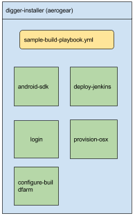

# Ansible Roles for installing AeroGear Digger

## Project Info

|                 | Project Info  |
| --------------- | ------------- |
| License:        | Apache License, Version 2.0  |
| Documentation:  | https://github.com/aerogear/digger-installer  |
| Issue tracker:  | https://issues.jboss.org/browse/AGDIGGER  |
| Mailing lists:  | [aerogear-users](http://aerogear-users.1116366.n5.nabble.com/) ([subscribe](https://lists.jboss.org/mailman/listinfo/aerogear-users))  |
|                 | [aerogear-dev](http://aerogear-dev.1069024.n5.nabble.com/) ([subscribe](https://lists.jboss.org/mailman/listinfo/aerogear-dev))  |
| IRC:            | [#aerogear](https://webchat.freenode.net/?channels=aerogear) channel in the [freenode](http://freenode.net/) network.  |

## Requirements

Ansible 2.2.0 or higher.


## Running Digger on existing OpenShift instance

### Prerequisites:

#### Persistent volume (by default 10Gi, but it can be changed for different needs)

1. Unless you have built OpenShift locally, be sure to grab the [oc command, v1.3+](https://github.com/openshift/origin/releases/tag/v1.3.1)

1. Stand up an OpenShift cluster from origin master, installing the standard image streams to the OpenShift namespace:

        oc cluster up

1. Setup simple persistent volume on new cluster execute:

**Note**: jenkins-persistent-template.json and android-sdk-persistent-template.json
template files require OpenShift persistent volumes.
Persistent volume setup is not part of the templates and requires separate steps.
If you already have persistent volumes feel free to skip this step.
Other wise take the following steps twice to create both pvs, replacing `<folder>` with `jenkins` and `android-sdk-linux`
```
        rm -R /tmp/digger/<folder>
        mkdir -p /tmp/digger/<folder>
        chmod -R 777 /tmp/digger/<folder>
        # creating a cluster wide persistent volume like the one we use requires
        # an admin user on OpenShift.
        oc login -u system:admin
        oc create -f pv-sample-templates/<folder>/sample-pv.json
```
Note that `mkdir` and `chmod` commands above should be executed in the Docker-machine, in case of using Docker-machine (boot2docker) on Mac.

You can find templates for creating PV's backed by glusterFS or NFS in pv-sample-templates/android-sdk-linux and pv-sample-templates/jenkins

### Notes about logging in to the master node

1. If you are running the playbook locally but pointing at a remote master node then login_url must be set when running the playbook.

2. If you are running the playbook remotely (i.e. while in an ssh session) then login_url does not need to be set as the default address for oc login is https://localhost:8443.

#### Using insecure connections

If you wish to use an insecure connection you can pass the skip_tls environment variable which will bypass the certificate check when logging in to openshift.

To pass it with the ansible-playbook, it should look like:

```
-e "skip_tls=true"
```

### Execute the playbook:

#### Example command line to execute aerogear digger ansible install
```
ansible-playbook -i <your-inventories-file> sample-build-playbook.yml
```

The playbook executes the following steps for you:

- Creates a Project in OpenShift
- Installs Jenkins
- Configures Jenkins
- Installs AndroidSDK to a PV
- [Configures an OSX node](./provision-osx/README.md)
- Installs Nagios and triggers checkes

See the image below for an overview of the playbook and roles


## Running Digger on OpenShift dedicated

### Prerequisites:

* Persistent volumes x 3 - Default sizes 40Gib, 10Gib, 1GiB
* OpenShift command line client installed locally
* Java installed locally
* An existing SSH Key Pair locally. Public key will need to be uploaded to the Jenkins server
* SSH access to a macOS server outside the OpenShift cluster if required
* Set all host groups variables except for `macos` to `ansible_connection=local`

A subset of the roles in this repository should be run using the `deploy` tag in `sample-build-playbook.yml`

Execute the following:

`ansible-playbook -i <your-inventories-file> sample-build-playbook.yml --tags=deploy,provision-osx`

If you do not have an external macOS node setup, run the following:

`ansible-playbook -i <your-inventories-file> sample-build-playbook.yml --tags=deploy`




## License

Apache 2.0
